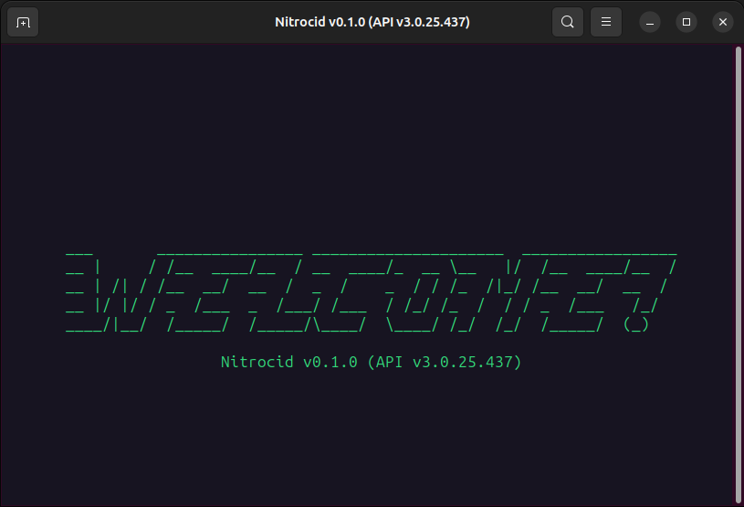

# Linux

<figure><figcaption></figcaption></figure>

Installing Nitrocid KS on Linux is straightforward, but we recommend installing the simulator using the manual unpack method.

Before performing the installation, your Linux system must meet the following requirements:


Extra kernel add-ons may require additional hardware on your computer to work. For example, the BassBoom addon requires that you have audio drivers installed on your computer.


### KS v0.1.0 or later

To run Nitrocid KS in the absolute minimum requirements, your computer needs to have the following installed:

| System            | Framework                                                          | Terminal                      |
| ----------------- | ------------------------------------------------------------------ | ----------------------------- |
| Supported distros | [.NET 8.0](https://dotnet.microsoft.com/en-us/download/dotnet/8.0) | Konsole, GNOME Terminal, etc. |

### KS v0.0.24.0


We support installing KS 0.0.24.0 until the full deprecation of .NET Framework.


To run Nitrocid KS in the absolute minimum requirements, your computer needs to have the following installed:

| System            | Framework                                                          | Terminal                      |
| ----------------- | ------------------------------------------------------------------ | ----------------------------- |
| Supported distros | [.NET 8.0](https://dotnet.microsoft.com/en-us/download/dotnet/8.0) | Konsole, GNOME Terminal, etc. |
| Supported distros | [Mono 5.10+](https://www.mono-project.com/download/stable/)        | Konsole, GNOME Terminal, etc. |

### Required packages

You can consult the required dependencies here:


[dependency-information.md](../dependency-information.md)


## Installation

There are several ways to install Nitrocid KS on Linux systems.

### Method 1: Manual unpack

If you like to manually unpack the Nitrocid KS packages, follow these steps:

1. Ensure that you have all the required software installed
2. Download the latest release ZIP file from [this page](https://github.com/Aptivi/Kernel-Simulator/releases).
3. Unpack the ZIP archive to any folder of your choice
4. Open your favorite terminal emulator, like Konsole, and change the working directory to a folder containing the Nitrocid KS executable
5. Execute `dotnet Nitrocid.dll` to start the kernel


For 0.0.24.x or older, files that end with the `-dotnet` prefix means that it's for .NET 6.0.


### Method 2: Ubuntu PPA

If you're running Ubuntu, you can install KS using the Ubuntu PPA. Just follow these steps:

1. Open your terminal emulator and execute the following:
   * `sudo add-apt-repository ppa:eofla/kernel-sim`
   * `sudo apt update`
2. Install the `kernel-simulator` package
   * `sudo apt install kernel-simulator`
3. Start `ks` or use your app drawer to find `Nitrocid KS`

## Bleeding-edge

Bleeding-edge builds usually come from building the development branch of the kernel, and they usually contain bugs and other untested features.

If you're a tester to such software, please follow the steps on your Windows machine. Please be sure that you're signed in to your GitHub account.

1. Open [this page](https://github.com/Aptivi/Kernel-Simulator/actions/workflows/build-linux.yml)
2. Select the most recent build
3. Scroll down to Artifacts and click on the `ks-build` button to download the ZIP file
4. Extract the file. Be sure that you have the latest version of your favorite archive manager installed
5. Open your favorite terminal emulator, like Konsole, and change the working directory to a folder containing the Nitrocid KS executable
6. Execute `dotnet Nitrocid.dll` to start the kernel
