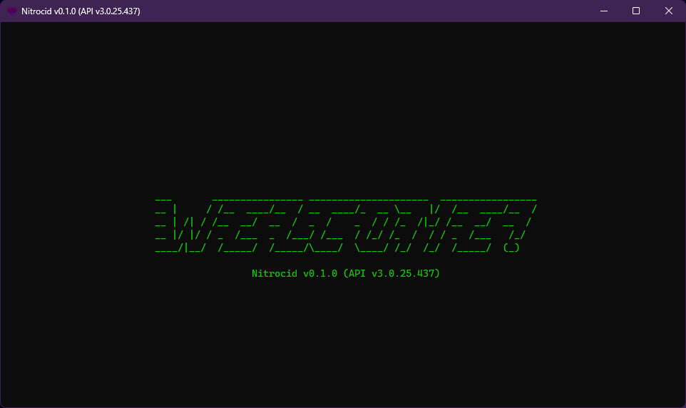
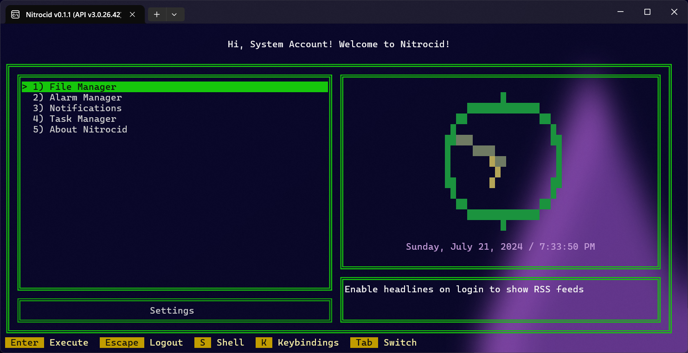

# 🔮 v0.1.x.x series

<figure><figcaption></figcaption></figure>

This kernel series is the first kernel series that actually – and finally – showed seriousness about the beta version of the simulator as outlined in the ancient product documentation dating back to the first ever release, 0.0.1. It added a staggering amount of features that you can't even count! It also brought in massive amounts of improvements to the point that it has been re-imagined like never before!

Below is an excerpt for this statement in [0.0.1's documentation](https://github.com/Aptivi/NitrocidKS/blob/v0.0.1-alpha/src/Windows/0.0.1/Kernel%20Simulator/Documentation/Documentation%20-%20faq.txt):


```
Q: Why is this kernel unfinished?
A: Because it is still on early alpha development stage. We are currently at 0.0.x stage. Stages:

	0.0.x indicates that it is alpha
	0.x.x indicates that it is beta
	x.99.x indicates that it is release candidate
	x.x.x indicates that it is final release
```


It also has renewed the look in several ways, including the modern logon screen. It holds under API v3.0, which means that mods that depend on API v2.1 or lower won't work with this version or higher. This API revision was released on **March 11th, 2024**.


You can check out more detailed changelogs using the `changes` command. Quick overview of the changes can be found in the [Releases](https://github.com/Aptivi/NitrocidKS/releases) page.


Version legend:

* <mark style="color:green;">**Green**</mark>: Indicates additions
* <mark style="color:yellow;">**Yellow**</mark>: Indicates improvements
* <mark style="color:red;">**Red**</mark>: Indicates removals
* <mark style="color:purple;">**Purple**</mark>: Indicates something else

## Version 0.1.0.x series

This series started with API version v3.0.25.437 for the final version of Nitrocid KS 0.1.0 released on March 11th, 2024. Before this release, we have spent a year and a half in its development, and here are the pre-release versions:

* [Beta 1](https://github.com/Aptivi/NitrocidKS/releases/tag/v0.1.0-b1) - API v3.0.25.0 - February 22nd, 2023
* [Beta 2](https://github.com/Aptivi/NitrocidKS/releases/tag/v0.1.0-b2) - API v3.0.25.42 - August 10th, 2023
* [Beta 3](https://github.com/Aptivi/NitrocidKS/releases/tag/v0.1.0-b3) - API v3.0.25.377 - December 28th, 2023
* [Release Candidate](https://github.com/Aptivi/NitrocidKS/releases/tag/v0.1.0-rc) - API v3.0.25.411 - February 1st, 2024

### Version 0.1.0.0

The following changes have been made:

* <mark style="color:green;">Added a truckload of commands and features</mark>
* <mark style="color:green;">Added a truckload of API functions</mark>
* <mark style="color:green;">Added a truckload of screensavers and splashes</mark>
* <mark style="color:green;">Added more themes</mark>
* <mark style="color:green;">Added features that enhance your kernel modding experience</mark>
* <mark style="color:green;">Added kernel addons that are uninstallable</mark>
* <mark style="color:green;">Added many more features and surprises</mark>
* <mark style="color:yellow;">New splash,</mark> <mark style="color:yellow;"></mark><mark style="color:yellow;">`welcome`</mark><mark style="color:yellow;">, enabled by default</mark>
* <mark style="color:yellow;">New screensaver,</mark> <mark style="color:yellow;"></mark><mark style="color:yellow;">`matrixbleed`</mark><mark style="color:yellow;">, enabled by default</mark>
* [<mark style="color:yellow;">New documentation added</mark>](https://aptivi.gitbook.io/nitrocid-ks-manual)
* <mark style="color:yellow;">Overall revamped look</mark>
* <mark style="color:yellow;">Settings is now easier to use</mark>
* <mark style="color:yellow;">Re-written the whole kernel and its components</mark>
* <mark style="color:yellow;">Over 2000 general and performance improvements!</mark>
* <mark style="color:yellow;">Fixed many bugs</mark>
* <mark style="color:red;">Removed support for .NET Framework</mark>
* <mark style="color:red;">Removed support for legacy libraries</mark>
* <mark style="color:red;">Removed kernel 16 colors support</mark>
* <mark style="color:red;">Removed legacy features</mark>

### Version 0.1.0.1

The following changes have been made:

* <mark style="color:yellow;">Fixed last-minute bugs caught in the project documentation phase</mark>
* <mark style="color:yellow;">General improvements</mark>

### Version 0.1.0.2

The following changes have been made:

* <mark style="color:yellow;">Fixed a security bug related to the Git addon</mark>
* <mark style="color:yellow;">General improvements</mark>

### Version 0.1.0.3

The following changes have been made:

* <mark style="color:yellow;">Fixed bugs related to the selection style</mark>
* <mark style="color:yellow;">General improvements</mark>

### Version 0.1.0.4

The following changes have been made:

* <mark style="color:yellow;">Fixed kernel panic caused by the notification system</mark>
* <mark style="color:yellow;">General improvements</mark>

### Version 0.1.0.5

The following changes have been made:

* <mark style="color:green;">Added config migration!</mark>
* <mark style="color:yellow;">Fixed a regression in the alias command</mark>

### Version 0.1.0.6

The following changes have been made:

* <mark style="color:yellow;">Used embedded resources</mark>
* <mark style="color:yellow;">Fixed Chocolatey batch files</mark>
* <mark style="color:yellow;">General improvements</mark>

### Version 0.1.0.7

The following changes have been made:

* <mark style="color:yellow;">Fixed translation of descriptions in the config finder</mark>

### Version 0.1.0.8

The following changes have been made:

* <mark style="color:yellow;">Updated libraries</mark>
* <mark style="color:yellow;">Improved settings migration to support screensavers</mark>
* <mark style="color:yellow;">Fixed migration not working for integer-based settings</mark>

### Version 0.1.0.9

The following changes have been made:

* <mark style="color:yellow;">General improvements</mark>

### Out-of-band servicing releases

The below versions were released to incorporate general improvements:

* v0.1.0.10 - July 21st, 2024

### Manuals

We have stable and beta manuals for reference:

#### Stable manuals

Available manuals for below versions:


[Nitrocid KS v0.1.0 - Manual](https://app.gitbook.com/o/fj052nYlsxW9IdL3bsZj/s/8WTX95xf6ky54JzTCqMT/)


#### Beta and RC manuals

Available manuals for below beta and RC versions:


[Nitrocid KS v0.1.0 Release Candidate - Manual](https://app.gitbook.com/o/fj052nYlsxW9IdL3bsZj/s/3mRuFh68DHtbpLXUGDzq/)



[Nitrocid KS v0.1.0 Beta 3 - Manual](https://app.gitbook.com/o/fj052nYlsxW9IdL3bsZj/s/kfeoFVXA0LPgBamKZDG4/)



[Nitrocid KS v0.1.0 Beta 2 - Manual](https://app.gitbook.com/o/fj052nYlsxW9IdL3bsZj/s/RoaqpM3GSf9vXxRAagbV/)



[Nitrocid KS v0.1.0 Beta 1 - Manual](https://app.gitbook.com/o/fj052nYlsxW9IdL3bsZj/s/Ad5vIFTQSlbQ4N2BpB8m/)


## Version 0.1.1.x series

<figure><figcaption></figcaption></figure>

This series started with API version v3.0.26.42 for the final version of Nitrocid KS 0.1.1 released on July 23rd, 2024.

### Version 0.1.1.0

The following changes have been made:

* <mark style="color:green;">Added The Nitrocid Homepage</mark>
* <mark style="color:green;">Added new commands</mark>
* <mark style="color:green;">Added new screensavers</mark>
* <mark style="color:green;">Added new themes</mark>
* <mark style="color:green;">Added playing radio stations</mark>
* <mark style="color:green;">Restored "beepsynth"</mark>
* <mark style="color:green;">Added more hashing algorithms</mark>
* <mark style="color:green;">Added image viewer</mark>
* <mark style="color:green;">Added the new "settings" UI</mark>
* <mark style="color:yellow;">Made some apps more interactive</mark>
* <mark style="color:yellow;">Merged GRILO into Nitrocid</mark>
* <mark style="color:yellow;">Theme studio classic UI now indicates color changes</mark>
* <mark style="color:yellow;">You can view file sizes directly next to their names in IFM</mark>
* <mark style="color:yellow;">Improved base configuration handling and initialization</mark>
* <mark style="color:yellow;">Enhanced VT support for text editor TUI</mark>
* <mark style="color:yellow;">Improved appearance of Snaker</mark>
* <mark style="color:yellow;">Improved appearance of boot log and journal log viewers</mark>
* <mark style="color:yellow;">ExecPath is now neutralized</mark>
* <mark style="color:yellow;">General improvements and bug fixes</mark>
* <mark style="color:red;">Removed time/date corner</mark>
